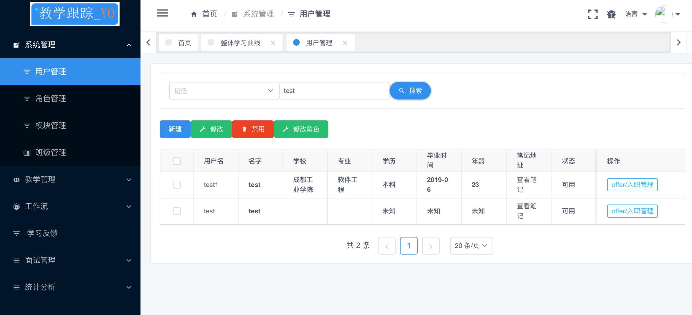
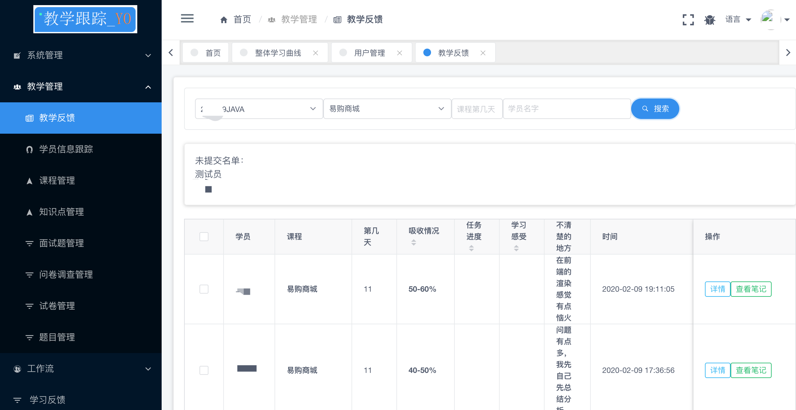
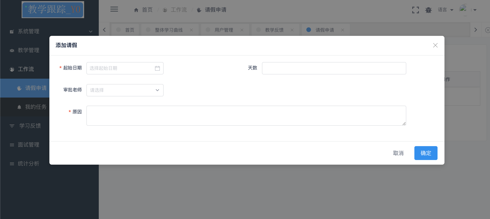
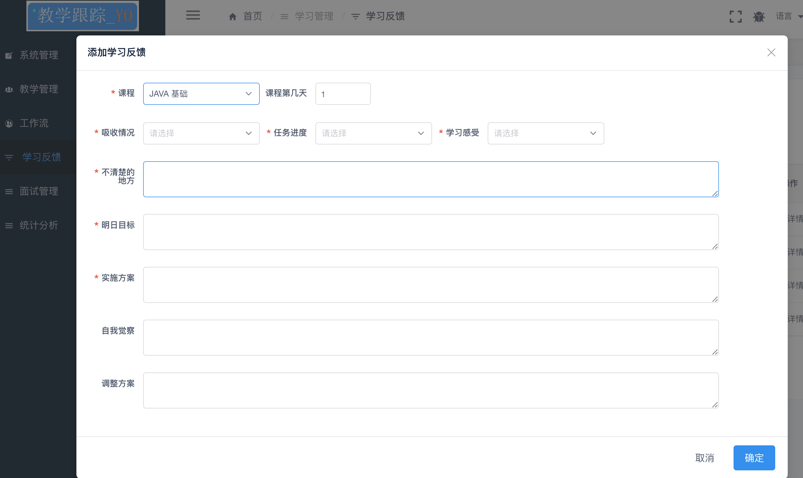
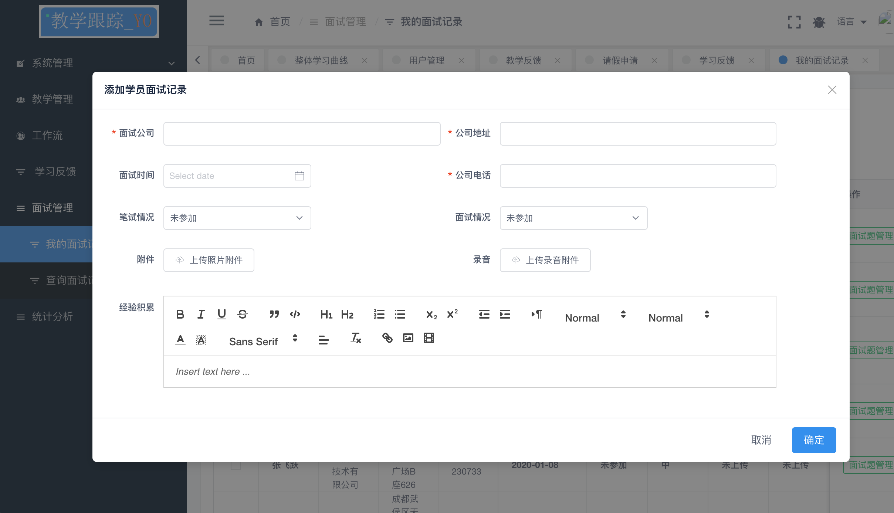
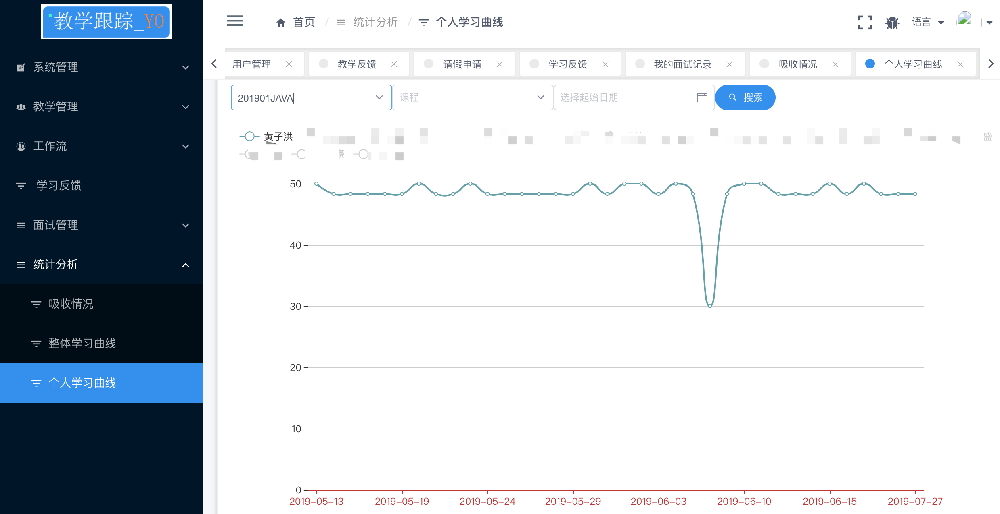

# 服务器api

```
教学跟踪管理系统-api服务器
https://github.com/tamsiuloong/tqt-api.git
```
# 技术体系
```
服务器:springboot+mysql
前 端:vue+iviewui+elementui
```


# 功能介绍

这套系统用于本人培训工作中管理系统，初衷是为了快速了解学员的吸收情况，减少公司和本人的工作量。

- 系统管理

  - 用户管理
  - 角色管理
  - 模块管理
  - 班级管理

  

- 教学管理

  - 教学反馈
  - 学员信息跟踪
  - 课程管理
  - 知识点管理
  - 面试题管理
  - 问卷调查管理
  - 试卷管理
  - 题目管理

  

- 工作流

  - 请假申请
  - 我的任务

  

- 学习反馈

  

- 面试管理

  - 我的面试记录
  - 查询面试记录

  

- 统计分析

  - 吸收情况
  - 整体学习曲线
  - 个人学习曲线

  


## 前端ui

```

教学跟踪管理系统-admin管理ui
https://github.com/tamsiuloong/tqt-admin.git

教学跟踪管理系统-学生在线考试ui
https://github.com/tamsiuloong/tqt-exam.git

```


## 数据库脚本
```
需要完整数据库sql请关注:
今日头条:JAVA在召唤
```


